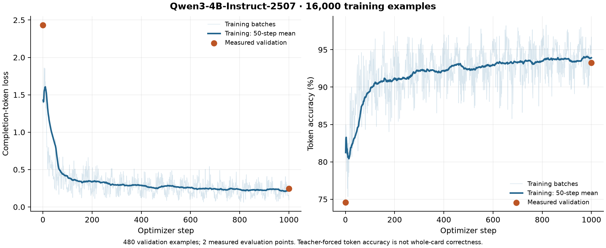

# MTG Oracle Text Generator

Turn a card idea into editable card JSON with Oracle-style rules text. This
repository contains the description-generation and review pipeline, dataset
preparation tools, a QLoRA training recipe, and evaluation against the unchanged
[mtgish parser](https://github.com/i5jb/mtgish).

**GitHub hosts the code, documentation, examples, and evaluation reports.
Hugging Face hosts the prepared datasets and trained adapters.** Their download
links and pinned revisions are recorded in [release status](release-status.json)
after publication. Local release files in `dist/` are staging copies ignored by Git.

A request such as “a midsize red Giant” can leave cost and stats to the model.
A detailed request must preserve its mechanics. Names, rarity, costs and stats
are editable suggestions when unspecified. Parser acceptance does not establish
intent fidelity, game balance, or official Magic rules correctness.

## Current status

| Artifact | Status |
| --- | --- |
| Full Oracle description corpus | [Public dataset](https://huggingface.co/datasets/vishvananda/mtg-oracle-design-descriptions-v2): 316,372 train / 400 final-test cases; [v2 split policy](docs/two-way-split.md) |
| Names + rarity pilot dataset | Packaged locally: 19,065 train / 572 validation; not uploaded |
| Completed Qwen3 4B training pilot | 16,000 train / 480 validation; predates names and rarity |
| First full-corpus training segment | [963-step development report](reports/full-corpus-step-963/README.md): 254/256 schema-valid outputs; 126/256 accepted by mtgish |
| Revised training run | Reached step 19,385 / 19,774; [finishing the same epoch](https://huggingface.co/jobs/vishvananda/6ac840d0095c5780893009ca) from the saved optimizer state |
| Interactive preview | [Card workshop](https://tetrarchs.com/cards/new): checkpoint 19,385 in Q4_0 alongside GPT-6 Luna |
| Full training and final-test mtgish results | **Pending** — no final-test score claimed |
| Public model checkpoints | [Checkpoint repository](https://huggingface.co/vishvananda/mtg-oracle-qwen3-4b-checkpoints-20261007); weights are published as training saves them |

## Use the data and fine-tune

Python 3.11–3.12 is required for the locked GPU environment. Dataset preparation
and parser evaluation run on CPU; training requires a CUDA GPU. Install
[uv](https://docs.astral.sh/uv/getting-started/installation/) for the locked recipe.

```bash
python3.12 -m venv .venv
source .venv/bin/activate
python -m pip install -r requirements.txt

export MTG_DATASET=vishvananda/mtg-oracle-design-descriptions-v2
export MTG_DATASET_REVISION=7c1bbca04b4259c15c397c5c6a00af5e143ef21e
python src/hub_dataset.py download --repo-id "$MTG_DATASET" \
  --revision "$MTG_DATASET_REVISION" --directory data/oracle

python src/train_qlora.py --dataset data/oracle \
  --config configs/qwen3-4b-two-way.json --preflight

# Start with a 20-step smoke run. Use a fresh output directory for each run.
uv run --frozen --script src/train_qlora.py --dataset data/oracle \
  --config configs/qwen3-4b-two-way.json --output runs/smoke --max-steps 20

# One configured epoch, starting again from the pinned base.
uv run --frozen --script src/train_qlora.py --dataset data/oracle \
  --config configs/qwen3-4b-two-way.json --output runs/full --max-steps -1
```

The development machine has an unpublished staging copy at
`dist/names-rarity-pilot-v1`; it is not included in a Git clone. That partial
dataset has no final test. The command above downloads the complete published
v2 release: training plus one locked 400-case final panel. There is no separate
validation split. All card types and colors are covered; rare abilities stay in
training. See the [split policy and coverage table](docs/two-way-split.md).
Each release supplies standard `messages`, TRL `prompt`/`completion`, and
provenance-rich records. [Dataset format and generation](docs/dataset.md) explains
how to rebuild it; [training](docs/training.md) covers larger models and GPUs.
The [quarantine recovery workflow](docs/recovery.md) rechecks false positives
and repairs descriptions with independent review while preserving original data.

The [full-run workflow](docs/full-run.md) connects dataset freezing, token-length
checks, bounded HF Jobs, resumable checkpoints, paired base/tuned evaluation,
loss and mtgish plots, and model/CPU-serving exports. Its preparation watcher
can wait for the remaining corpus work; GPU submission is an explicit step.
Its staged recipe can stop after a short training segment and evaluate a fixed
development panel before continuing the same epoch, with a shared spending cap.
For remote GPU jobs, use its CPU token-cache preparation step first: eight
workers tokenize and verify the data once, and each GPU phase loads the same
verified Arrow files without repeating full-corpus preprocessing.

## Latest development results

The first one-hour segment on the full corpus reached 6.15% of one epoch.
On the fixed 256-case development panel, schema compliance improved from
**8.59% to 99.22%** and whole-card mtgish acceptance from **0% to 49.22%**
against the untuned Qwen baseline. Complex mechanics still have intent errors.
That run was canceled to improve the split. Its report uses the original split;
the workshop now serves checkpoint 19,385 from the revised run alongside Luna. The CPU preview uses a merged
Q4_0 model, so the NF4 development scores do not measure that serving artifact.
The panel emphasizes difficult card types and is not a full-corpus accuracy
estimate. See the [loss curves, parser coverage and qualitative review](reports/full-corpus-step-963/README.md).

## Measured pilot results



The 1,000-step pilot reduced validation loss from **2.43366 to 0.24646** and raised
teacher-forced completion-token accuracy from **74.58% to 93.24%**. Training took
46.5 minutes on an A100. Validation was measured before and after training;
there are only two validation points, not a continuous validation curve.
These numbers do not measure successful card generation. Known intent failures
remain. See [results, raw CSV and parser measurements](reports/pilot-16k/README.md).

## Evaluate generated cards

```bash
# Run only after the fixed training endpoint; do not use final test to choose checkpoints.
# Downloads the pinned upstream source and builds only the Go parser in artifacts/.
python src/setup_mtgish.py

uv run --frozen --script src/generate.py --dataset data/oracle \
  --config configs/qwen3-4b-two-way.json --adapter runs/full \
  --split test --output runs/test-predictions.jsonl
python src/evaluate.py --dataset data/oracle \
  --predictions runs/test-predictions.jsonl --split test \
  --output runs/test-metrics
```

[Evaluation](docs/evaluation.md) describes the final-test procedure, whole-card
parsing, failure denominators, and comparison of base versus adapter.
[Publishing](docs/publishing.md) covers GitHub, HF dataset/model cards, hashes,
and adapter staging. No private editor or compiler is required.

[Preference training](docs/rl-plan.md) compares Luna intent judgments, parser
rewards and Oracle embeddings. The first requested DPO pilot waits for the
completed SFT epoch, then samples four candidates for each of 512 training-only
requests. Luna scores intent; Sol independently reviews proposed pairs. A frozen
64-request development panel measures the change separately from the 400-case
final SFT test. The pilot has a $10 GPU ceiling and does not deploy automatically.
See the [earlier reward diagnostics](reports/rl-preparation/README.md) for the
motivation and parser-reward limitations.

Run CPU checks with `python -m unittest discover -s tests -v`. Original code and
documentation use [MIT](LICENSE); card content and base models retain their own
[rights and attribution](DATA_LICENSE.md).
