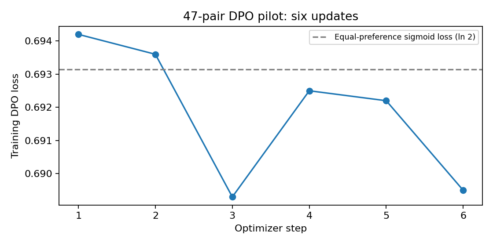

# DPO pilot after one supervised epoch

Completed 2026-10-09. **The training pipeline worked; this small pilot showed no
measured improvement.** It trained on 47 preference pairs for six updates and is
available in the [workshop](https://tetrarchs.com/cards/new) at the user's request.
The completed supervised model remains available for rollback.

[Preference dataset and raw outputs](https://huggingface.co/datasets/vishvananda/mtg-oracle-preference-pilot-v1) ·
[DPO adapter](https://huggingface.co/vishvananda/mtg-oracle-qwen3-4b-dpo-pilot-20261009) ·
[Next experiment](../../docs/next-preference-round.md)

## Paired development results

| Measure | Completed SFT | DPO pilot |
| --- | ---: | ---: |
| Schema valid | 64/64 | 64/64 |
| Whole-card mtgish accepted | 48/64 (75%) | 48/64 (75%) |
| Sol-judged faithful intent | 63/64 | 63/64 |
| Faithful and parsed | 48/64 | 48/64 |
| Judge abstentions | 0 | 0 |

These are **64 correlated hand-authored development requests**, not a
representative accuracy sample and not the locked 400-case SFT final test.
Generation used Transformers NF4 plus each adapter, the same frozen prompt,
greedy decoding, seed 29, no thinking and a 2,048-token limit. Sol judged intent
at medium effort with source identity hidden. It is a model judgment, not human
expert ground truth. [Exact identities and parser revision](comparison.json).

Oracle text was unchanged in all 64 paired outputs. Eight outputs changed other
fields: five names, four mana costs and one type line, with overlap. The same
explicit-name failure remained: a request for **Mosskeeper** produced **Nissa,
Vital Force** while using Mosskeeper as the subtype. Increasing the preference
dataset and evaluating more varied requests is necessary before concluding
whether DPO helps this task. Another full SFT epoch is not a prerequisite.

The earlier SFT final test measured 260/400 mtgish acceptance (65%); it has not
been rerun on this DPO adapter. Do not substitute this 75% development number
for that test or infer an improvement from the different denominators.

## Training and labels

We sampled 2,048 SFT candidates for 512 training-only requests. Luna proposed
77 preference pairs, but blinded Sol review accepted only 20. Many rejections
were caused by acceptable defaults, omitted optional reminder text or implicit
basic-land mana. Both judges had matched all 219 constructed calibration labels;
that diagnostic did not establish reliability on natural errors.

Recovery reviewed 356 more candidates across 94 training families, including
source Oracle outputs as possible positives. Those outputs were independently
judged for the actual request, never assumed correct. The final set has **35
chosen Qwen samples and 12 chosen source targets**. Every rejected output is a
sampled Qwen failure. Inconsistent judgments and conflicting judgments about
identical cards were excluded. At most one pair per source family was used.
No final-test or development examples trained the policy.

The recipe continues the completed SFT LoRA against a separate frozen copy of
the same adapter: NF4 base, LoRA rank 16/alpha 32, sigmoid DPO, beta 0.1, learning
rate 5e-6, effective batch eight, one pass. The 100-step pilot ceiling is an upper
bound; 47 pairs produced only six updates. The first logged learning rate was
zero during warmup. Training loss is not semantic accuracy.

[Raw loss and learning rates](training.csv) · [Training summary](training-summary.json)

The initial policy and reference tensor hashes matched. The reference remained
unchanged, the policy changed, and the exported safetensors tensor hash matches
the final policy. The adapter includes the original SFT weights and should be
loaded **directly on the pinned base**, without stacking the SFT adapter again.

GPU training itself took about 30 seconds; the training job's entire allocation
was 2 minutes 46 seconds. Candidate sampling used about 30 minutes 26 seconds.
The conservative allocation cost bound is **$1.584 for both GPU jobs**, excluding
Codex judge usage. This is an accounting bound, not a verified provider invoice.

## Workshop verification

The deployed artifact is a single BF16 merge into the original pinned base,
F16 GGUF export and Q4_0 quantization. Three basic generation probes passed
JSON/required-field checks and mtgish. A public comparison exercised both models and all
validator reporting with the production terminology guide enabled.

In that public planeswalker check, both models preserved starting loyalty and
the two requested abilities. Qwen changed the explicitly requested name to
“Moss-Kelp, the Bellow” and used the unsupported subtype Mosskeeper; Luna kept
Mosskeeper as the name, chose a supported subtype and passed mtgish. This is a
known remaining failure, not evidence of deployment breakage. A parser score
cannot detect an incorrect name. The quantized workshop results are separate
from the NF4 development table above.

The serving hash and pinned publications are recorded in
[release status](../../release-status.json). The next experiment prioritizes
Sol-reviewed repairs, exact metadata checks, varied evaluation and measurements
under the actual serving configuration.
