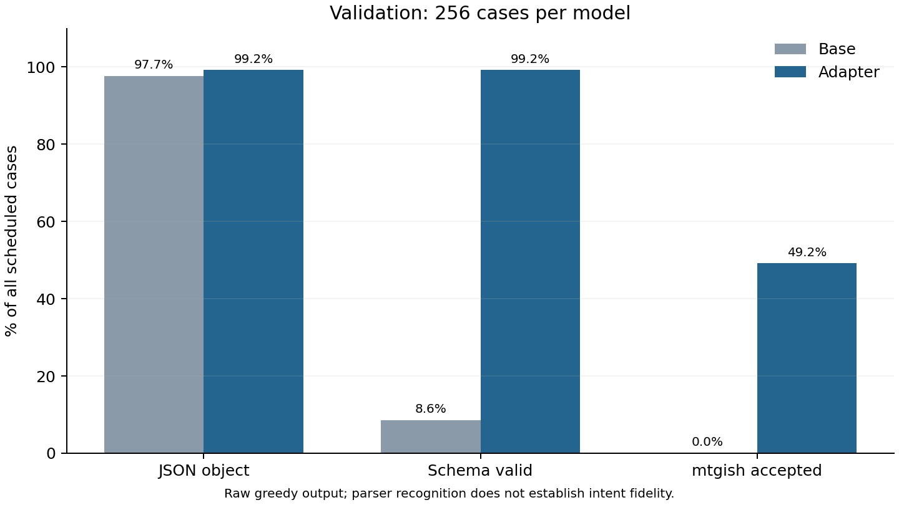
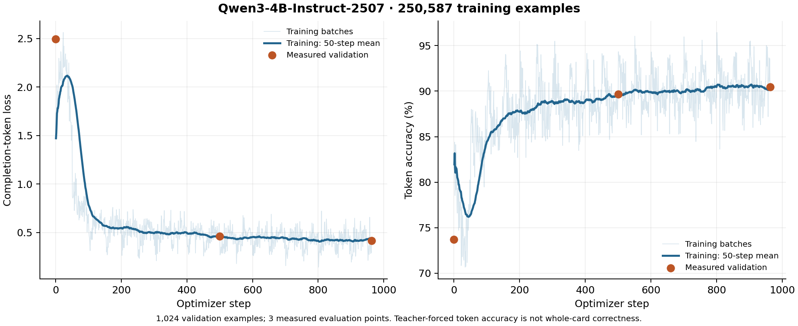

# Full-corpus training: checkpoint 963

The first one-hour segment substantially improves structured output, but complex
card mechanics still need work. This is a **fixed 256-case development panel**,
not final-test accuracy, and the checkpoint has not been promoted to the editor.

| Check | Untuned Qwen3 4B | Tuned checkpoint 963 |
| --- | ---: | ---: |
| JSON object | 250/256 (97.66%) | 254/256 (99.22%) |
| Required card schema | 22/256 (8.59%) | 254/256 (99.22%) |
| Whole-card mtgish acceptance | 0/256 (0%) | 126/256 (49.22%) |
| Planeswalker mtgish acceptance | 0/32 (0%) | 9/32 (28.12%) |
| Reached output-token limit | 5/256 | 2/256 |

The baseline is the untuned **Qwen model**, not Luna. Both arms used the same
prompts, NF4 backend, greedy decoding, 2,048-token limit and fixed batches of 16.
Schema failures count as failures without attempting the parser. In the base
arm, 219 outputs had at least one array-type mismatch, commonly `design_notes`.
This is the raw task-schema baseline, without JSON repair or a repair loop.

The panel reserves 32 planeswalkers and up to 16 multi-face cards and spreads
cases across description styles and distinct source groups. It emphasizes
hard cases and is not a representative sample of the entire corpus.

## What improved and what remains

The tuned model accepted 21/23 minimal descriptions, 27/32 supplied-current-Oracle
inputs, and 16/31 historical-wording inputs. Broad gameplay descriptions remain
weak: 7/38 broad/plain and 7/27 broad/shorthand outputs pass mtgish. Both malformed
tuned JSON outputs reached the token limit. Generated names and rarity are
present in all 254 schema-valid outputs; none uses Draft Card or Untitled Design.

The same pinned parser accepts **226/256 reference targets (88.28%)**: 17 are
rejected, 10 ignored, and 3 out of scope. The adapter passes 125 of those 226
reference-supported cases (55.31%), plus one alternate design whose reference
is unsupported. Reference coverage is context, not a hard ceiling on alternate
valid completions. Of the 208 schema-valid generated cards with nonempty rules
text, 86 pass (41.35%); 40 of the 126 overall passes have empty rules text.

A qualitative review of 32 preselected cases found that simple requested
characteristics and explicit names usually survive. Complex failures include
turning an activated-ability discount into spell-casting text, omitting token
colors or boast effects, giving life to a creature, and changing modal choices
into mandatory effects. Parser passes do not establish intent fidelity.
[Review notes](qualitative-review.json) identify each case; these are assistant
judgments, not independent human labels or a calibrated accuracy score.

Two held-out source pairs also need review: a broad description asks a creature
to untap itself when its target only pays blue mana to gain flying, and a
historical Clone input includes a no-creatures casting restriction absent from
its current target. Audit the relevant generation/exclusion rules on training
data before a revised dataset release. Keep held-out cases out of training and
preserve this frozen release and these scores for reproducibility.

## Training measurements

Training ran for 3,604.6 seconds, completing 963 optimizer updates and 0.06149
of the configured epoch over 250,587 training examples. The QLoRA recipe used
an NF4 frozen base, BF16 computation, LoRA rank 16, microbatch 16 and gradient
accumulation 1. Peak allocated GPU memory was 52.84 GiB on an A100 80 GB.

Validation loss on the fixed 1,024-example monitoring sample fell from **2.49610
to 0.41593**, and teacher-forced completion-token accuracy rose from **73.72% to
90.44%**. These are token metrics, not whole-card success rates. The late loss
curve continues to decline slowly; one segment does not establish convergence.

## Reproduce and continue

- Dataset: [public release](https://huggingface.co/datasets/vishvananda/mtg-oracle-design-descriptions/tree/4e32fd88762697f984f8091947d6ba65246074d5).
- Adapter: [checkpoint 963](https://huggingface.co/vishvananda/mtg-oracle-qwen3-4b-checkpoints-20261007/tree/1f60f1100f02695f2193615199f46d86c16084b9), tag `prepared-v1-train-step-00000963`.
- The [comparison receipt](comparison.json) pins model, adapter, dataset, parser,
  generation code, selected IDs and decoding hashes. The [reference check](reference-parser-summary.json)
  uses the same panel and parser. Graph source data is in `training-curve.csv`.
- Follow [the staged workflow](../../docs/full-run.md) to resume the optimizer and
  scheduler from `checkpoint-963`, preserving the one-hour training limit and
  shared budget ledger. Evaluate the same panel after the next segment and
  review mechanics before deployment or additional training.

The original evaluation hit its shared 30-minute deadline after the full base
arm and 80 tuned outputs. A second job resumed the remaining 176 tuned cases
without changing the protocol. The final result includes every scheduled case.
Further GPU work is paused for review; no final-test data has been evaluated.
Prepared datasets and model weights remain on Hugging Face, outside this Git repo.
