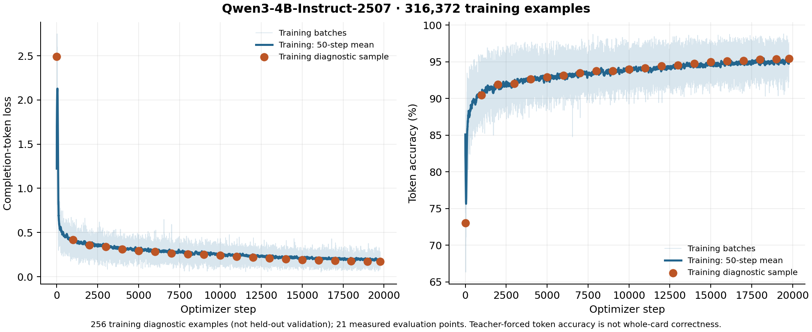
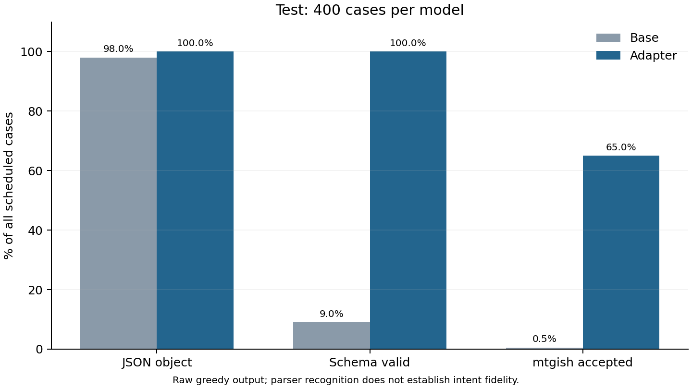

# Full supervised epoch, revised split

The Qwen3 4B adapter completed **19,774 optimizer steps / one epoch** over
316,372 training descriptions. The final 389 steps resumed the saved optimizer
and scheduler state after the first job reached its training-time limit.

The [public adapter](https://huggingface.co/vishvananda/mtg-oracle-qwen3-4b-checkpoints-20261007/tree/small-holdout-v2-train-step-00019774)
is pinned at `decd0eb5344719c298649ca4cf2be4950da4b18d`. A merged Q4_0 export is
live in the [workshop](https://tetrarchs.com/cards/new) alongside Luna.
The same weights with final-test evidence are available in the
[evaluated release](https://huggingface.co/vishvananda/mtg-oracle-qwen3-4b-checkpoints-20261007/tree/small-holdout-v2-full-epoch-evaluated),
revision `bfa00523c8380c38456bc72f537713e5af5fb376`.

| Training diagnostic | Before | After |
| --- | ---: | ---: |
| Completion-token loss | 2.49131 | 0.17042 |
| Completion-token accuracy | 73.00% | 95.41% |

These measurements use a fixed **256-example training sample**, not held-out
validation. They do not measure generation accuracy or intent fidelity. There
is no separate validation split.

## Locked final generation test

| Model | Scheduled cases | Schema valid | Whole-card mtgish accepted |
| --- | ---: | ---: | ---: |
| Pinned untuned base | 400 | 36 (9.0%) | 2 (0.5%) |
| Completed SFT epoch | 400 | 400 (100.0%) | 260 (65.0%) |

The denominator is all 400 scheduled held-out cases. The tuned model had 130
parser rejections, six ignored cards and four out-of-scope cards; no output hit
the token limit. Accepted outputs required no card-specific rewrites. Both arms
used the same frozen prompts, greedy decoding, token budget and NF4 backend.
[comparison.json](comparison.json) includes type/style breakdowns and exact
model, dataset, parser and generation identities.

These numbers measure recognition by the unchanged mtgish grammar, **not
intent fidelity, game balance or official rules legality**. Unsupported grammar
can reject reasonable cards, and a parser can accept a card that changes the
requested meaning. The 400-case panel covers types and colors with source-family
holdout; it is not weighted to the frequency of real workshop requests. It is
reported once for the completed SFT model and is not used to tune DPO.

The curve contains all 19,774 logged training observations. Mean logged loss is
0.27611; the last 100 observations average 0.19668. The resumed Transformers
summary reports `train_loss = 0.00379` because it divides the continuation's loss
sum by the cumulative step count. That value is not the full-epoch mean. Use the
complete history in [training-curve.csv](training-curve.csv) instead.

Three local deployment smoke prompts (a vanilla Giant, a tax counterspell, and
a tapped blue/black land) produced schema-valid cards, preserved their requests,
and parsed with mtgish. This small smoke check is not an accuracy estimate. The
NF4 GPU evaluation and merged Q4_0 CPU serving model use different quantization
paths. Semantic errors remain a known limitation from the preceding checkpoint.

[Training summary](training-summary.json) records dataset, adapter and source
hashes. The separate preference pilot uses training-only prompts and a frozen
64-request development diagnostic; it does not train or tune against this
400-case final SFT test.
