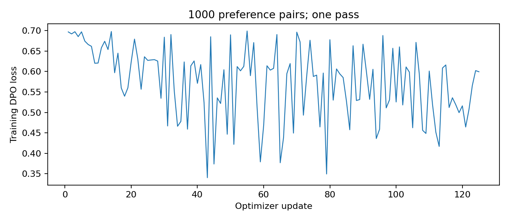
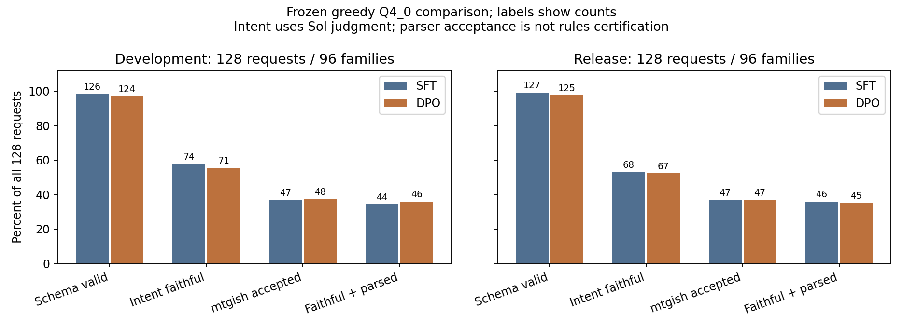
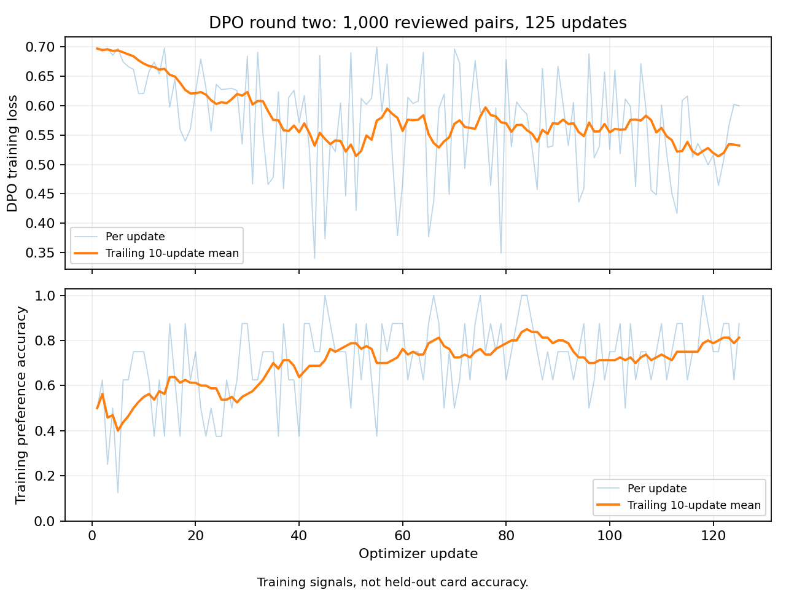

# DPO round two: measured results

**No clear quality gain was measured.** Locked-release intent was 67/128 for
DPO versus 68/128 for SFT; mtgish accepted 47/128 for both. The paired intervals
include zero, and complex user regression cases still fail.

Trained 1000 reviewed pairs for 125 updates (one pass).

The policy and frozen reference started at the completed one-epoch SFT adapter.
The preference generator and reviewer are separate Sol sessions; their errors can be correlated.
Luna supplied an additional critic; every proposed pair received a final high-effort Sol review.
These are model judgments, not human-expert labels or official rules certification.

| Production Q4_0 measure | SFT development | DPO development | SFT locked release | DPO locked release |
| --- | ---: | ---: | ---: | ---: |
| schema valid | 126/128 | 124/128 | 127/128 | 125/128 |
| intent faithful | 74/128 | 71/128 | 68/128 | 67/128 |
| faithful clean oracle | 67/128 | 66/128 | 67/128 | 63/128 |
| mtgish accepted | 47/128 | 48/128 | 47/128 | 47/128 |
| faithful and parsed | 44/128 | 46/128 | 46/128 | 45/128 |
| exact metadata failure | 6/128 | 6/128 | 2/128 | 2/128 |
| abstentions | 4/128 | 9/128 | 10/128 | 8/128 |

The two 128-request panels contain 96 families each; each original-design family has two detail levels.
Source-card families were seen during SFT but excluded from this preference round. This tests new requests,
not wholly unseen-card knowledge. The old 400-card SFT final test was not reused for decisions.
The final checkpoint was preselected for release evaluation; midpoint scores are development diagnostics.
Parser acceptance does not establish intent, balance or legality. Unsupported valid mechanics remain possible.

Intent requires schema/explicit-field success and a high-confidence pass without violations. Clean Oracle also requires style score 2.

Loss and training reward accuracy are not held-out card accuracy. Raw metrics and family-bootstrap intervals accompany this report.
NF4 and Q4_0 comparisons are reported separately. Production comparisons share system prompt, guide, greedy decoding and limits.
The workshop was deployed at the user's request as an experimental preview; this is not an automatic quality promotion. Known library and planeswalker failures remain.

The [workshop](https://tetrarchs.com/cards/new) serves the final quant with two sampled local alternatives and Luna. Explicit choices are stored locally for later review; artwork can be generated for the selected original draft.

[Complete run and collection details](run-notes.md) · [Run the model locally](../../docs/serve-preference-model.md) · [Public preference dataset](https://huggingface.co/datasets/vishvananda/mtg-oracle-preferences-v2) · [Adapters, checkpoints and GGUF](https://huggingface.co/vishvananda/mtg-oracle-qwen3-4b-dpo-round2-20261009)

## Paired changes

| Panel | Intent change (95% interval) | mtgish change (95% interval) |
| --- | ---: | ---: |
| Development | -2.34 pp (-7.94 to +3.17) | +0.78 pp (-1.60 to +3.79) |
| Release | -0.78 pp (-5.30 to +3.70) | +0.00 pp (-3.05 to +3.15) |

Intervals resample source families, not individual detail variants. They describe these designed panels and correlated model judgments, not all user requests. A small change whose interval includes zero does not establish an improvement.

## Training diagnostics

One pass over 1,000 pairs took 823 seconds. Mean loss was 0.5742. First/last 25-update loss means were 0.6419/0.5421; training reward preference accuracy was 55%/77%. These windows contain different training pairs and are not held-out accuracy. All six saved checkpoints are public.

## Provenance and checks

- [Training config](training-config.json), [summary](training-summary.json), [identity](identity.json), [per-update CSV](training.csv).
- [Development metrics](q4_development.json), [release metrics](q4_release.json), [NF4 diagnostic](nf4_development.json).
- [Dataset publication](dataset-publication.json), [model publication](model-publication.json): immutable revisions and verified file counts.
- [GPU cost bounds](compute-costs.json), [recorded collection tokens](collection-usage.json), [deployment checks](deployment.json).
- [Named serving probes](serving-probes.json), including failed planeswalker and opponent-library requests.

Parser infrastructure errors remain in denominators and are counted separately from rejected grammar. Development had one per arm. See the raw release metrics for its counts. The 400-card SFT final panel was not rerun here. Interactive temperature-0.35 pairs and the reported greedy evaluation are different modes.
