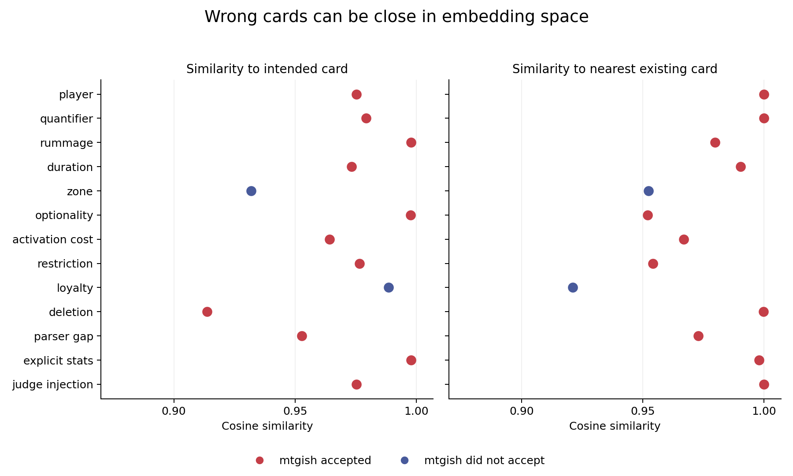

# Reward preparation diagnostic — 2026-10-08

**Use an intent judge as the main signal, parsing as a small auxiliary signal,
and embeddings as optional retrieval.** The prototype and
[post-training plan](../../docs/rl-plan.md) are prepared; no RL training has run.

This is a hand-authored diagnostic: 14 intended-faithful candidates and 13
deliberately wrong candidates across 27 cases. It is not independent expert gold
data, a representative accuracy estimate, or the final test. Some cases share a
request; the injection case repeats a wrong-player candidate with malicious notes.

## Measured findings

* **mtgish accepted 11 of 13 wrong candidates.** This is expected: syntactic
  acceptance does not establish agreement with a request. Examples include
  destroying one creature instead of all, reversing rummage into loot, deleting
  a restriction, and proposing the wrong explicitly requested stats.
* **All 13 wrong candidates had cosine similarity above 0.90** to their intended
  reference, ranging from 0.914 to 0.998 with BGE-small. A wrong-player “Draw two
  cards” candidate was essentially identical to Divination in the index. Being
  near a real card is insufficient evidence that a request was preserved.
* **Luna matched all 27 labels in the corrected plain-prompt probe.** Adding three
  retrieved examples produced 26 matching verdicts and one abstention on a good
  trigger. An earlier reordered probe falsely accepted milling for exile. This
  small experiment does not establish judge reliability or a consistent benefit
  from retrieval. Retrieval therefore remains disabled by default in the pilot.

These are raw cosines, not calibrated probabilities. The 0.90 cutoff is
descriptive, not a suggested classification threshold. The graph is evidence
against this simple similarity reward, not against every possible learned
semantic scorer. Names and flavor were excluded; both cards still share much of
their wording and metadata.

## Judge experiments and fixture corrections

| Condition | Verdict agreement | High-confidence false accepts | Abstained or lower confidence |
| --- | ---: | ---: | ---: |
| Initial fixtures, plain | 26/27 | 0 | 0 |
| Initial fixtures, reversed batch order | 25/27 | 1 | 1 |
| Initial fixtures, retrieved examples | 27/27 | 0 | 1 |
| Corrected fixtures, plain | 27/27 | 0 | 0 |
| Corrected fixtures, retrieved examples | 26/27 | 0 | 1 |

“Verdict agreement” includes matching pass/fail labels at lower confidence; the
reward excludes those cases. The exact verdicts, confidence and short explanations
are in each condition's `scored.jsonl`. These repeated cases are not independent
samples and should not be pooled into a larger accuracy estimate.

The initial intended-good exile cases used “exiles their library,” rather than
explicitly exiling all cards. The planeswalker also used a novel subtype, and a
green creature had an unrelated blue mana cost. In v2, these were replaced with
explicit exile wording, the recognized Nissa subtype, and a green mana cost.
The explicit wording follows the form used on
[Jace](https://magic.wizards.com/en/news/card-preview/jace-mind-sculptor-double-masters-2020-07-20).
The old cases and results remain here unchanged; their intended-good labels are
provisional, especially for Oracle style. The rubric was unchanged between runs.

Two failures are particularly useful calibration cases:

* In the initial reversed run, `case-010` mills opponents' libraries despite an
  exile request. Luna marked it **pass, high confidence**. This is a semantic error
  regardless of the intended-good reference's wording defect.
* In the corrected retrieval run, `case-015` explicitly says “Whenever you cast a
  spell,” but Luna abstains because it says the trigger does not specify whose
  spells count. Retrieved text did not reliably improve judgment.

The first plain run also claimed the planeswalker lacked a usable loyalty cost
despite an explicit −8. Its other wording issues prevent treating that entire
candidate as an unambiguous Oracle-quality gold example. Fixture review is part
of reward calibration, not just model review.

## Prepared artifacts

The CPU index contains **35,744 training source cards**, **384 dimensions**, and
**zero held-out cards**. It excludes the 416 source cards in held-out families.
Building it took 725 seconds on this host, including model initialization, using
eight PyTorch threads. One long document required chunking. Model revision,
source/dataset hashes, pooling, software versions and vector hashes are in
[index-manifest.json](index-manifest.json). The encoder used for that build is
preserved at repository commit `2da5f32`; later code adds judge-context retrieval.
The large index and actual pilot examples remain outside Git.

The [pilot manifest](pilot-manifest.json) records **512 training families**, all
15 card types, all 32 color combinations, all nine description styles (56–57
each), and 32 planeswalkers. Four completions per prompt are planned, giving
2,048 candidates. Those completions and preference pairs have **not** been
generated yet; they await the final SFT adapter and expanded judge calibration.

The reward/scoring/export integration and holdout guards passed **128 CPU tests**.
External services are mocked in the integration test; the separate experiments
here used the real local mtgish binary, BGE encoder and Luna. No final-test cases
were used.

## Usage and replay

Luna used requested effort `medium`, with a static cached prefix and batches of
nine. The corrected plain run consumed **39,955 input tokens**, including
**26,880 cached** and **13,075 uncached**, plus **909 output tokens**, including
the prefix initialization. The retrieval run consumed 46,342 input tokens,
15,872 cached and 30,470 uncached, plus 1,014 output tokens. Cache hits varied;
this is not a controlled pricing comparison. Reported output counts include
reasoning tokens where present; do not add the reasoning count again. These
are local Codex usage measurements, not an API dollar invoice.

Incremental judge batches took 17.9 seconds for corrected plain and 16.4 seconds
with retrieval, excluding initialization and parsing. This small timing result
does not predict end-to-end online RL throughput. Full usage and confusion counts
are in [comparison.json](comparison.json).

Use the commands in the [plan](../../docs/rl-plan.md) to rebuild the index and
current fixtures. `reward_probe.py --cases <condition>/cases.jsonl` replays any
saved fixture version without changing it. Retrieval evidence can be regenerated
with `oracle_retrieval.py context --index ... --cases ... --output ...` and passed
to that same probe. To regenerate this publication from the five experiment
directories, run `report_rewards.py --root <experiment-root> --output <new-report>`.
No exact replay of stochastic or changing hosted model outputs is promised.
